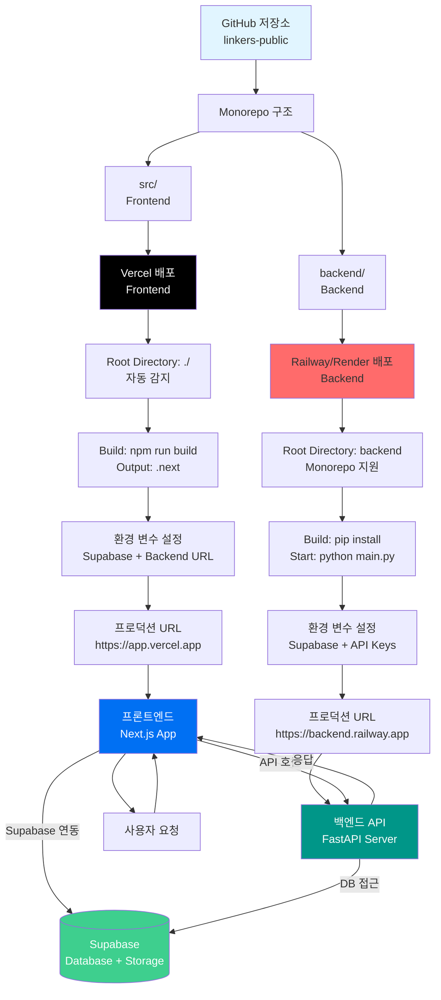

# Linkus Legal - 청년 법률 리스크 탐지 플랫폼
[2025년 새싹 해커톤 AI 서비스 기획서 양식.docx (1).pdf](https://github.com/user-attachments/files/23615180/2025.AI.docx.1.pdf)

영상 링크 : https://drive.google.com/file/d/1_gFeahMFP8BzKhhyMFtkiG5SegsyCMK9/view?usp=drive_link

> **알바·인턴·첫 직장 계약서를 혼자 보게 되는 20대들을 위한 AI 노동권 세이프티넷**

AI 기반 계약/노동 리스크 분석 시스템으로, 청년 근로자들을 위한 법률 서비스를 제공합니다.

## 📋 목차

- [주요 기능](#-주요-기능)
- [기술 스택](#️-기술-스택)
- [프로젝트 구조](#-프로젝트-구조)
- [빠른 시작](#-빠른-시작)
- [환경 설정](#-환경-설정)
- [백엔드 설정](#-백엔드-설정)
- [Legal RAG 모드](#-legal-rag-모드)
- [🤖 우리가 환각을 줄이기 위해 한 것](#-우리가-환각을-줄이기-위해-한-것)
- [🔗 LLM Toolchain 아키텍처](#-llm-toolchain-아키텍처)
- [📊 간단 평가 결과](#-간단-평가-결과)
- [API 사용 가이드](#-api-사용-가이드)
- [문제 해결](#-문제-해결)
- [배포 (무료 & 쉬운 방법)](#-배포-무료--쉬운-방법)
- [📘 백엔드 구현 가이드](./LEGAL_BACKEND_IMPLEMENTATION_GUIDE.md) - 해커톤/백엔드 개발자를 위한 완전한 구현 패키지
- [🛠️ 계약서 분석 도구화 설계](./backend/CONTRACT_ANALYSIS_TOOLS_DESIGN.md) - 백엔드 로직 도구화 설계 문서

## 🚀 주요 기능

### 법률 서비스 (Linkus Legal) - 청년 노동 안전망

#### 청년 특화 기능
- ✅ **알바/인턴/첫 직장 계약서 프리셋**: 청년이 자주 마주치는 계약서 유형에 최적화된 분석
- ✅ **청소년·청년 노동 가이드**: 고용노동부 자료 기반 RAG 검색으로 청년 노동자 맞춤 가이드 제공
- ✅ **실제 신고 루트/기관까지 안내**: 고용노동부, 노동청 등 실제 신고 경로와 연락처 제공

#### 핵심 기능
- **법률 문제 분석**: 계약서나 법률 문서를 업로드하여 AI가 자동으로 법적 위험 요소를 분석합니다
- **위험도 점검**: 문서 분석 후 법적 위험도를 0~100점으로 제공하고 색상으로 구분합니다
- **법적 리스크 설명**: 분석된 리스크 항목과 해당 법적 근거를 상세히 제공합니다
- **추천 대응 방법**: 각 법적 문제에 대한 구체적인 해결책과 대응 방법을 제시합니다
- **법률 검색**: RAG 시스템을 통해 입력한 법적 상황에 대한 관련 법률 시나리오와 대응 방법을 조회합니다
- **상황별 분석**: 고용 형태, 근무 기간, 사회보험 등 상세 정보를 입력하여 맞춤형 법률 분석을 제공합니다

#### 계약서 분석 고급 기능 (v2)
- **위험 지도 (Heatmap)**: 계약서 본문에 위험 구간을 시각적으로 표시
  - 왼쪽 세로 리스크 바 (Minimap): 조항별 위험도를 색상으로 한눈에 파악
  - 조항 카드형 섹션: 각 조항을 카드 형태로 구조화하여 가독성 향상
  - 하이라이트 태그 + 아이콘: 위험 조항에 카테고리 아이콘과 위험도 태그 표시
  - 위험 타임라인: 상단 네비게이션으로 전체 조항의 위험도 개요 확인
  - 법 조문 스니펫: hover 시 관련 법령 정보를 사이드 패널에 표시
- **조항 자동 라벨링**: "제n조" 패턴 자동 인식 및 조항 목록 생성
- **위험 조항 자동 하이라이트**: 텍스트 위치 기반 정확한 하이라이트
- **AI 기반 조항 리라이트**: 위험한 조항을 법적으로 안전한 문구로 자동 수정 제안
- **계약서 버전 비교**: 이전 계약서와 새 계약서를 비교하여 변경사항 및 위험도 변화 분석

## 🛠️ 기술 스택

### Frontend
- **Framework**: Next.js 14 (App Router)
- **Language**: TypeScript
- **UI**: React 18, Tailwind CSS
- **State Management**: Zustand
- **UI Components**: Radix UI

### Backend
- **Framework**: FastAPI
- **Language**: Python 3.9+
- **RAG**: LangChain
- **Vector DB**: Supabase pgvector
- **LLM**: Ollama (무료)
- **Embedding**: sentence-transformers (무료)
- **Document Processing**: PyPDF, pdfplumber

### Database & Storage
- **Database**: Supabase (PostgreSQL)
- **Vector Search**: pgvector (Supabase)
- **Authentication**: Supabase Auth
- **File Storage**: Supabase Storage

### Deployment
- **Frontend**: Vercel
- **Backend**: 독립 서버 또는 Vercel Serverless

## 📁 프로젝트 구조

```
linkers-public/
├── backend/                    # FastAPI 백엔드 서버
│   ├── api/                    # API 라우터
│   │   ├── routes_v2.py        # 공공입찰 API v2
│   │   ├── routes_legal_v2.py   # 법률 API v2 (주요, 권장)
│   │   └── routes_legal.py     # 법률 API v1 (레거시, 호환성용)
│   ├── core/                   # 핵심 RAG 모듈
│   │   ├── orchestrator_v2.py  # v2 오케스트레이터
│   │   ├── document_processor_v2.py  # v2 문서 처리기
│   │   ├── generator_v2.py      # v2 LLM/임베딩 생성기
│   │   ├── supabase_vector_store.py  # Supabase 벡터 스토어
│   │   ├── legal_rag_service.py     # 법률 RAG 서비스
│   │   ├── legal_chunker.py         # 법률 문서 청커
│   │   ├── contract_storage.py      # 계약서 스토리지
│   │   ├── async_tasks.py           # 비동기 작업 관리
│   │   └── tools/                   # 계약서 분석 도구 (Phase 1-3)
│   ├── models/                 # 데이터 모델
│   ├── scripts/                # 배치 처리 스크립트
│   ├── data/                   # 데이터 저장소
│   │   ├── legal/              # 법률/계약 RAG용 데이터
│   │   │   ├── laws/           # 근로기준법, 노동법 요약, 청년 노동 가이드
│   │   │   ├── standard_contracts/ # 표준 근로·용역·프리랜서·콘텐츠 계약서
│   │   │   ├── manuals/        # 직장 내 괴롭힘/성희롭 등 매뉴얼
│   │   │   └── cases/          # 가공된 시나리오/케이스 텍스트
│   │   ├── indexed/            # 인덱싱 완료 리포트
│   │   └── temp/               # 임시 파일
│   ├── main.py                 # FastAPI 메인 앱
│   ├── config.py               # 설정 관리
│   └── requirements.txt        # Python 의존성
│
├── src/                        # Next.js 프론트엔드
│   ├── app/                    # Next.js App Router
│   │   ├── legal/              # 법률 서비스 (Linkus Legal)
│   │   │   ├── page.tsx       # 법률 서비스 홈페이지
│   │   │   ├── layout.tsx     # 법률 서비스 레이아웃
│   │   │   ├── analysis/       # 법률 문제 분석 페이지
│   │   │   ├── search/        # 법률 검색 페이지
│   │   │   └── situation/     # 상황별 법률 분석 페이지
│   ├── components/            # React 컴포넌트
│   │   ├── legal/             # 법률 서비스 전용 컴포넌트
│   │   │   ├── FileUpload.tsx      # 파일 업로드
│   │   │   ├── RiskScore.tsx       # 위험도 점수 표시
│   │   │   ├── AnalysisResultCard.tsx  # 분석 결과 카드
│   │   │   └── SearchResultCard.tsx    # 검색 결과 카드
│   │   └── ui/                # 공통 UI 컴포넌트
│   ├── lib/                   # 유틸리티 및 라이브러리
│   │   └── rag/               # RAG 라이브러리
│   ├── apis/                  # API 서비스 함수
│   │   ├── legal.service.ts   # 법률 API 서비스 (v2)
│   │   └── contract-history.service.ts  # 계약서 히스토리 서비스
│   ├── stores/                # 상태 관리
│   └── supabase/              # Supabase 클라이언트
│       ├── supabase-client.ts # 싱글톤 클라이언트 (권장)
│       └── supabase-storage.ts # Storage 전용 (싱글톤 재사용)
│
├── package.json               # Node.js 의존성
└── README.md                  # 이 문서
```

## 🚀 빠른 시작

### 1. 저장소 클론
```bash
git clone [repository-url]
cd linkers-public
```

### 2. Frontend 설정

#### 의존성 설치
```bash
npm install
```

#### 환경 변수 설정
프로젝트 루트에 `.env.local` 파일을 생성:

```env
# Supabase (필수)
NEXT_PUBLIC_SUPABASE_URL=https://your-project.supabase.co
NEXT_PUBLIC_SUPABASE_ANON_KEY=your_anon_key

# Backend API URL (선택, 기본값: http://localhost:8000)
NEXT_PUBLIC_BACKEND_API_URL=http://localhost:8000

# Site URL (OAuth 리다이렉트용, 선택)
NEXT_PUBLIC_SITE_URL=http://localhost:3000
```

#### 개발 서버 실행
```bash
npm run dev
```

브라우저에서 [http://localhost:3000](http://localhost:3000)을 열어 확인하세요.

### 3. Backend 설정

> **⚠️ 중요**: `venv` 폴더는 `.gitignore`에 포함되어 있어 GitHub에 올라가지 않습니다.  
> 따라서 **처음 클론한 경우** 반드시 가상환경을 새로 생성하고 의존성을 설치해야 합니다.

#### Python 버전 확인
Python 3.9 이상이 필요합니다:
```bash
python --version
```

#### 가상환경 생성 및 활성화

**처음 클론한 경우 (필수):**
```bash
cd backend
python -m venv venv  # 가상환경 생성 (처음 한 번만)
```

**Windows:**
```bash
venv\Scripts\activate
```

**Linux/Mac:**
```bash
source venv/bin/activate
```

> **참고**: 이미 가상환경이 생성되어 있다면 생성 단계는 생략하고 활성화만 하면 됩니다.

#### 의존성 설치 (필수)
```bash
# 가상환경 활성화 후 반드시 실행
pip install -r requirements.txt
```

#### 환경 변수 설정
`backend/.env` 파일을 생성 (최소 설정):

```env
# Supabase 설정 (필수)
SUPABASE_URL=https://your-project.supabase.co
SUPABASE_SERVICE_ROLE_KEY=your_service_role_key
```

**참고**: 다음 설정들은 기본값으로 이미 활성화되어 있습니다:
- ✅ 로컬 임베딩 (sentence-transformers)
- ✅ Ollama LLM (로컬)
- ✅ Supabase pgvector

**선택적 설정** (필요시 추가):
```env
# Ollama 설정 (기본값: http://localhost:11434, llama3)
OLLAMA_BASE_URL=http://localhost:11434
OLLAMA_MODEL=llama3

# 로컬 임베딩 모델 (기본값: BAAI/bge-small-en-v1.5)
LOCAL_EMBEDDING_MODEL=BAAI/bge-small-en-v1.5

# Server Settings (선택)
HOST=0.0.0.0
PORT=8000
```

#### 서버 실행
```bash
python main.py
```

또는:

```bash
python -m uvicorn main:app --reload
```

서버가 정상적으로 실행되면:
- **API 문서 (Swagger UI)**: http://localhost:8000/docs
- **헬스 체크**: http://localhost:8000/api/health
- **프론트엔드**: http://localhost:3000 (별도 터미널에서 `npm run dev`)

#### 문서 인덱싱 (선택)
법률 문서를 벡터 DB에 인덱싱하려면:

```bash
# PDF 파일을 backend/data/legal/ 폴더에 넣고
python scripts/batch_ingest.py data/legal --mode legal
```

## 🔧 환경 설정

환경 설정에 대한 상세 가이드는 [SETUP.md](./SETUP.md)를 참고하세요.

**최소 설정:**
- Frontend: `.env.local` 파일에 Supabase 설정
- Backend: `backend/.env` 파일에 Supabase 설정

## 📚 Legal RAG 모드

법률/계약 문서를 RAG로 인덱싱하고 검색/분석하는 방법은 [LEGAL_RAG_GUIDE.md](./LEGAL_RAG_GUIDE.md)를 참고하세요.

**주요 기능:**
- 제n조 기준 청킹
- 벡터 검색
- 계약서 분석
- 상황별 맞춤 분석

## 🤖 환각 줄이기 전략

AI 환각을 최소화하고 검증 가능한 결과를 제공하는 방법은 [HALLUCINATION_REDUCTION.md](./HALLUCINATION_REDUCTION.md)를 참고하세요.

**주요 전략:**
- Hybrid Search + MMR
- 도메인 필터링
- 출력 제약
- 이중 검증 시스템

---

## 🔗 LLM Toolchain 아키텍처

도구 체인 아키텍처에 대한 상세 설명은 [ARCHITECTURE.md](./ARCHITECTURE.md)를 참고하세요.

**주요 도구:**
- DocumentParserTool
- ProvisionMatchingTool
- VectorSearchTool
- RiskScoringTool
- LLMExplanationTool

## 📊 간단 평가 결과

Linkus Legal의 정확성을 검증하기 위해 실제 계약서를 대상으로 평가를 수행했습니다. **"우리가 검증 관점을 갖고 있다"**는 것을 보여주기 위한 초기 평가 결과입니다.

### 평가 방법

- **테스트 데이터**: 표준 근로계약서 변형본 10건
- **평가 기준**: 직접 라벨링한 "위험 조항" 20개 기준
- **평가 지표**: Recall (재검출률), False Positive (오탐)

### 평가 결과

#### 위험 조항 재검출 (Recall)

- **검출된 위험 조항**: 18/20 (90%)
- **놓친 위험 조항**: 2건

**놓친 케이스 분석**:
1. **은근슬쩍 들어간 경업금지 조항 1건**
   - 원인: 경업금지 조항이 명시적으로 드러나지 않고 다른 조항에 섞여 있음
   - 개선 방향: 경업금지 관련 키워드 확장 및 문맥 분석 강화

2. **"인턴→정규직 전환 보장처럼 읽히지만 사실은 아님" 같은 애매한 표현 1건**
   - 원인: 모호한 표현으로 인한 의미 해석의 어려움
   - 개선 방향: 모호성 탐지 로직 강화 및 LLM 기반 의미 분석 개선

#### False Positive (오탐)

- **오탐 건수**: 3건
- **오탐률**: 약 15% (3/20)

**오탐 케이스 분석**:
- 대부분 "애매한 표현"으로 인한 과도한 위험도 판정
- 예: "회사 사정에 따라" 같은 모호한 표현을 위험하다고 판정했으나, 실제로는 표준 계약서에서도 사용되는 일반적인 표현

### 개선 계획

1. **경업금지 조항 탐지 강화**
   - 경업금지 관련 키워드 확장
   - 문맥 기반 탐지 로직 추가

2. **모호성 탐지 개선**
   - 애매한 표현에 대한 더 정교한 의미 분석
   - 표준 계약서와의 비교를 통한 False Positive 감소

3. **평가 데이터셋 확장**
   - 더 다양한 계약서 유형 추가 (프리랜서, 인턴, 계약직 등)
   - 실제 사용자 계약서 수집 및 평가

### 평가의 한계

- 현재 평가는 **초기 검증 단계**이며, 더 많은 데이터와 다양한 케이스가 필요합니다
- 실제 법률 판단은 변호사 등 전문가의 검토가 필요하며, 이 도구는 **보조 도구**로 사용되어야 합니다
- 계약서의 맥락과 산업별 특성을 고려한 추가 평가가 필요합니다

**이 평가는 "완벽한 시스템"을 보여주기 위한 것이 아니라, "검증 가능한 접근"을 보여주기 위한 것입니다.**

```bash
# 법률 문서 인덱싱
cd backend
python scripts/batch_ingest.py data/legal --mode legal

# 법률 검색 테스트
curl "http://localhost:8000/api/v2/legal/search?q=근로시간&limit=5"

# 계약서 분석 테스트
curl -X POST "http://localhost:8000/api/v2/legal/analyze-contract" \
  -F "file=@contract.pdf" \
  -F "title=프리랜서 계약서"
```

## 📱 주요 페이지

### 법률 서비스 (Linkus Legal)
- `/legal` - 법률 서비스 홈페이지 (Landing Page)
  - 서비스 소개 및 기능 안내
  - 법적 리스크 점검, 계약서 분석, 법적 시나리오 제공 소개
  - CTA 버튼 (문서 업로드, 법률 문제 분석 시작하기)
- `/legal/analysis` - 법률 문제 분석 페이지
  - 계약서/법률 문서 파일 업로드 (드래그 앤 드롭 지원)
  - 법적 상황 텍스트 입력
  - 위험도 점수 표시 (0~100점, 색상 구분)
  - 법적 리스크 설명 (법적 근거 포함)
  - 추천 대응 방법 제시
  - 관련 법적 시나리오 제공
- `/legal/search` - 법률 검색 페이지
  - 법적 상황 검색 입력
  - RAG 시스템 기반 검색 결과 제공
  - 각 시나리오별 법적 근거, 추천 대응 방법, 관련 법률 목록 표시
  - 위험도 레벨 표시 (높음/보통/낮음)
- `/legal/situation` - 상황별 법률 분석 페이지
  - 6가지 상황 템플릿 제공 (인턴/수습 해고, 무급 야근, 임금 체불, 직장 내 괴롭힘, 프리랜서 대금 미지급, 스톡옵션/성과급)
  - 한 줄 요약 + 자세한 설명 입력
  - 고용 형태, 근무 기간, 주당 근무시간, 수습 여부, 사회보험 등 고급 정보 입력 (선택사항)
  - v2 API 기반 맞춤형 법률 분석 결과 제공
  - 위험도 점수/레벨, 법적 근거, 체크리스트, 대화 스크립트, 유사 케이스 제공
- `/legal/contract` - 계약서 분석 페이지 (v2)
  - 계약서 파일 업로드 (드래그 앤 드롭 지원)
  - PDF, HWPX, HWP 파일 지원
  - 분석 진행 상태 실시간 표시
  - 분석 히스토리 목록 (최근 분석 내역)
  - 2컬럼 레이아웃 (업로드 영역 + 히스토리)
- `/legal/contract/[docId]` - 계약서 상세 분석 페이지
  - 2컬럼 레이아웃 (계약서 전문 뷰어 + 분석 결과 패널)
  - 계약서 전문 하이라이트 (위험 조항 색상 표시)
  - 위험 조항 클릭 시 상세 분석 표시
  - 실시간 채팅 기능 (조항별 질문 및 답변)
  - 분석 결과 카드 (위험도, 법적 근거, 수정 제안)
- `/legal/assist` - 상담 허브 페이지
  - 즉시 상담 (Quick Ask) - 자연어 질문 기반 법적 위험도 분석
  - 문서 기반 상담 (Contract-Aware Talk) - 계약서 위험 조항 연동 상담
  - 상황별 상담 (Situation-Based Talk) - 상세 정보 입력 기반 맞춤 상담
- `/legal/assist/quick` - 빠른 상담 페이지
  - ChatGPT 스타일 큰 입력창
  - 대표 질문 버튼 제공
  - 상황 자동 태깅 (Burden Type, 위험도)
  - 즉시 위험도 라벨 표기
- `/legal/cases` - 유사 케이스 페이지
  - 법률 케이스 검색 및 필터링
  - 카테고리별 케이스 목록 (인턴, 임금, 스톡옵션, 프리랜서, 괴롭힘)
  - 위험도별 정렬 및 추천 케이스
- `/legal/cases/[id]` - 케이스 상세 페이지
  - 케이스 상세 정보 및 법적 근거
  - 관련 법률 조문 및 대응 방법
  - 유사 케이스 추천

## ⚖️ 법률 서비스 UI (Linkus Legal)

법률 서비스는 청년 법률 리스크 탐지를 위한 AI 기반 계약/노동 리스크 분석 시스템입니다.

### 주요 페이지

#### 1. 홈페이지 (`/legal`)
- **Hero Section**: 서비스 소개 및 강조된 CTA 버튼
- **기능 소개 카드**: 법적 리스크 점검, 계약서 분석, 법적 시나리오 제공
- **서비스 소개**: 각 기능에 대한 상세 설명
- **CTA Section**: 문서 업로드 및 법률 검색 버튼

#### 2. 법률 문제 분석 페이지 (`/legal/analysis`)
- **파일 업로드 섹션**: 
  - 드래그 앤 드롭 지원
  - PDF, DOC, DOCX, TXT 파일 지원
  - 파일 크기 제한 (기본 10MB)
- **텍스트 입력 섹션**: 
  - 법적 상황을 직접 텍스트로 입력
  - 파일 업로드와 텍스트 입력 중 선택 가능
- **분석 결과 표시**:
  - 위험도 점수 (0~100점, 색상 구분: 높음/보통/낮음)
  - 법적 리스크 설명 (제목, 설명, 법적 근거, 추천 대응 방법)
  - 관련 법적 시나리오 목록

#### 3. 계약서 분석 페이지 (`/legal/contract`)
- **2컬럼 레이아웃**:
  - 좌측: 계약서 업로드 영역 (60%)
  - 우측: 분석 히스토리 목록 (40%)
- **파일 업로드 섹션**:
  - 드래그 앤 드롭 지원 (시각적 피드백)
  - PDF, HWPX, HWP 파일 지원
  - 파일 크기 및 형식 검증
  - 업로드 진행 상태 표시
- **히스토리 목록**:
  - 최근 분석 내역 표시
  - 분석 날짜, 제목, 위험도 점수
  - 클릭 시 상세 분석 페이지로 이동
- **분석 진행 상태**:
  - 실시간 진행률 표시
  - 분석 완료 시 자동 리다이렉트

#### 4. 계약서 상세 분석 페이지 (`/legal/contract/[docId]`)
- **2컬럼 레이아웃**:
  - 좌측: 계약서 전문 뷰어 (50%)
  - 우측: 분석 결과 패널 (50%)
  - 오른쪽: AI 법률 상담 채팅 (토글 가능한 사이드바, 400px)

##### 계약서 뷰어 (위험 지도 Heatmap 기능)

**위험 지도 시각화**:
- **왼쪽 세로 리스크 바 (Minimap)**: 조항별 최고 위험도를 색상으로 표시
  - High: 빨간색 (`bg-red-500`)
  - Medium: 노란색 (`bg-amber-400`)
  - Low: 파란색 (`bg-sky-400`)
  - Hover 시 툴팁으로 조항 정보 표시 (제n조, 위험도, 이슈 개수)
  - 클릭 시 해당 조항으로 자동 스크롤

**조항 카드형 섹션**:
- 각 조항을 카드 형태로 구조화
- 조항 헤더 바:
  - 조항 번호 및 제목 표시
  - 위험도별 배경색 (High: 빨간색, Medium: 노란색, Low: 파란색)
  - 위험도 배지 및 이슈 개수 표시
- 조항 내용: 하이라이트된 텍스트 포함

**하이라이트 태그 + 아이콘**:
- 위험 조항에 인라인 태그 표시
  - 카테고리 아이콘 (근로시간 ⏱, 보수 💰, 수습 💼 등)
  - 카테고리명 + 위험도 (예: "근로시간 · High")
  - 위험도별 색상 구분 (빨강/노랑/파랑)
- 하이라이트된 텍스트: 밑줄 및 배경색으로 강조

**위험 타임라인 네비게이션**:
- 상단에 가로 스크롤 가능한 타임라인
- 각 조항을 점으로 표시 (색상 = 최대 위험도)
- 클릭 시 해당 조항으로 스크롤
- 선택된 조항은 확대 + 테두리로 강조

**요약 뷰 (상단 고정)**:
- 카테고리별 위험도 진행 바 (비율 표시)
- 가장 위험한 조항 TOP 3 미리보기
- 클릭 시 해당 조항으로 이동

**법 조문 스니펫 사이드 패널** (xl 이상 화면):
- 하이라이트된 조항에 hover 시 오른쪽에 법령 정보 표시
- 관련 법령 목록 및 조항 스니펫
- Fade-in 애니메이션

**마이크로 인터랙션**:
- 조항 카드 hover: shadow 증가 + 살짝 위로 이동
- 하이라이트 hover: 배경색 변화 + 밑줄 애니메이션
- 선택된 조항: ring 애니메이션 (1-2초 후 제거)
- 부드러운 스크롤 전환

##### 분석 결과 패널

**조항 목록** (접을 수 있는 섹션):
- 조항 목록을 접기/펼치기 가능한 섹션으로 표시
- 조항 개수 배지 표시
- 클릭 시 해당 조항으로 이동

**분석 결과**:
- 위험도 통계 (전체/높음/보통/낮음)
- 위험 조항 목록 (카드 형태)
- 조항 클릭 시 상세 정보 표시
- 법적 근거, 수정 제안, 질문 스크립트 제공
- 탭 구조:
  - 요약: 전체 요약 및 카테고리별 카드
  - 조항별: 발견된 이슈 목록
  - 법령·표준: 법적 근거 및 표준계약서 비교
- 필터링 기능:
  - 카테고리별 필터
  - 위험도별 필터 (High/Medium/Low)
  - 정렬 옵션 (위험도 순 / 계약서 순서)

**이슈 카드 기능**:
- 해당 조항 보기: 계약서에서 위치로 이동
- 이 부분 질문하기: AI 채팅으로 연결 (자동 프리필)
- 수정안 보기: 제안된 수정 문구 확인
- AI 수정: AI 기반 조항 리라이트 (원문/수정문 비교)

##### AI 법률 상담 채팅

**토글 가능한 사이드바**:
- 오른쪽에 고정 사이드바 (반응형 너비: 모바일 전체, 태블릿 90vw, 데스크톱 400px)
- 헤더 아래에서 시작 (z-index 조정)
- 슬라이드 애니메이션 (열기/닫기)
- 오른쪽 하단 플로팅 버튼으로 열기
- 메시지 카운트 배지 표시
- **ESC 키로 채팅 닫기** 지원
- **모바일 스와이프 제스처**: 헤더를 오른쪽에서 왼쪽으로 스와이프하여 채팅 닫기

**채팅 기능**:
- 메시지 저장/로드 (localStorage)
- 추천 질문 자동 생성
- 선택된 이슈 기반 컨텍스트 제공
- Markdown 렌더링
- 프리필 질문: 이슈 카드에서 "질문하기" 클릭 시 자동 프리필
- **에러 처리 및 재시도**: 네트워크 오류 시 재시도 버튼 제공
- **스마트 스크롤**: 사용자가 위로 스크롤한 경우 자동 스크롤 비활성화, "새 메시지 보기" 버튼 표시

**선택된 조항 정보**:
- **Sticky 고정**: 스크롤해도 상단에 고정되어 항상 보임
- 선택된 조항 번호 및 위험도 표시
- 조항 정보가 길 경우 자동 말줄임 처리

**접근성 개선**:
- 모든 버튼의 최소 터치 영역 44x44px 보장
- 키보드 네비게이션 지원 (ESC, Tab, Enter)
- 모바일에서 Ctrl+Enter 힌트를 "전송"으로 간소화
- 추천 질문 텍스트 말줄임 처리 (최대 2줄)

##### 기타 기능

**조항 자동 라벨링**:
- 조항 목록: 백엔드에서 자동 추출된 조항 목록 표시
- 조항 번호 인식: "제n조" 패턴 자동 감지
- 조항별 카테고리 분류

**위험 조항 자동 하이라이트**:
- 텍스트 하이라이트: `highlightedTexts` 배열 기반
- 위험도별 색상 (High: 빨간색, Medium: 노란색, Low: 파란색)
- 위치 정보: `startIndex`, `endIndex`로 정확한 위치 표시

**접근성 (A11y)**:
- ARIA 레이블: 모든 인터랙티브 요소에 `aria-label` 추가
- 키보드 네비게이션: 모든 버튼에 Enter/Space 키 지원
- 포커스 관리: `focus:ring` 스타일로 포커스 표시
- 시맨틱 HTML: `role`, `aria-labelledby` 속성 추가
- **터치 영역**: 모든 인터랙티브 요소의 최소 터치 영역 44x44px 보장
- **키보드 단축키**: ESC 키로 채팅 닫기, Ctrl+Enter로 메시지 전송

#### 5. 법률 검색 페이지 (`/legal/search`)
- **검색 입력**: 법적 상황을 텍스트로 입력
- **검색 결과 카드**: 
  - 각 시나리오별로 카드 형태로 표시
  - 법적 근거 섹션
  - 추천 대응 방법 섹션
  - 관련 법률 목록
  - 위험도 레벨 표시 (높음/보통/낮음)

#### 6. 상담 허브 페이지 (`/legal/assist`)
- **즉시 상담 (Quick Ask)**:
  - 자연어 질문만으로 법적 위험도·조항·상황 유형 자동 분류
  - 위반 가능성과 핵심 권리, 조문 근거 즉시 요약
  - ChatGPT 스타일 큰 입력창
  - 대표 질문 버튼 제공
- **문서 기반 상담 (Contract-Aware Talk)**:
  - 계약서에서 추출된 위험 조항 자동 연동
  - 문제 조항 선택 → 근거 기반 상담 → 수정문구 제안
- **상황별 상담 (Situation-Based Talk)**:
  - 상황 템플릿 또는 직접 입력 기반 맞춤 상담
  - 한 줄 요약 + 자세한 설명 입력
  - 고용 형태, 근무 기간, 주당 근무시간, 수습 여부, 사회보험 등 컨텍스트 활용
  - v2 API 기반 위험도 평가, 법적 근거, 체크리스트, 대화 스크립트, 유사 케이스 제공

#### 7. 유사 케이스 페이지 (`/legal/cases`)
- **케이스 검색 및 필터링**:
  - 법률 케이스 검색
  - 카테고리별 필터링 (인턴, 임금, 스톡옵션, 프리랜서, 괴롭힘)
  - 위험도별 정렬 (추천/최신/심각도)
- **케이스 목록**:
  - 각 케이스별 제목, 상황 요약, 주요 이슈
  - 위험도 레벨 표시
  - 관련 법률 키워드 태그
- **케이스 상세** (`/legal/cases/[id]`):
  - 케이스 상세 정보 및 법적 근거
  - 관련 법률 조문 및 대응 방법
  - 유사 케이스 추천
  - 케이스 기반 상담 기능

#### 8. 상황별 법률 분석 페이지 (`/legal/situation`)
- **상황 템플릿 제공**: 
  - 6가지 대표 상황 템플릿 제공 (인턴/수습 해고, 무급 야근, 임금 체불, 직장 내 괴롭힘, 프리랜서 대금 미지급, 스톡옵션/성과급)
  - 템플릿 선택 시 자동으로 카테고리 및 입력 필드 채움
  - 각 템플릿별 예시 가이드 제공
- **법적 상황 입력**: 
  - 한 줄 요약: 상황을 간단히 요약하여 입력
  - 자세한 설명: 언제부터, 어떤 일이 반복되는지, 문제점 등을 상세히 입력
  - 카테고리 선택: 인턴/수습 해고, 정규직 해고, 임금 체불, 무급 야근, 직장 내 괴롭힘, 프리랜서/용역, 스톡옵션/성과급, 기타/복합 상황
- **고급 정보 입력** (선택사항):
  - 고용 형태: 정규직, 계약직, 인턴, 프리랜서, 알바, 기타
  - 근무 기간: 3개월 미만, 3~12개월, 1~3년, 3년 이상
  - 주당 근무시간: 슬라이더로 입력 (기본 40시간)
  - 수습 여부: 예/아니오/모름
  - 사회보험 가입 여부: 모두 가입/일부만/전혀 없음/모름
- **맞춤형 분석 결과** (v2 API 기반):
  - **위험도 평가**: 
    - 위험도 점수 (0~100점)
    - 위험도 레벨 (High/Medium/Low)
    - 자동 태깅 (상황 유형 분류)
  - **법적 분석**:
    - 상황 요약 및 법적 관점 분석
    - 법적 근거 (관련 법령 조문 및 스니펫)
    - 법적 근거별 출처 타입 표시 (law, manual, case 등)
  - **실행 가능한 대응 방안**:
    - 즉시 조치 체크리스트 (우선순위별)
    - 권고사항 (단계별 대응 방법)
    - 회사/상담사 대화 스크립트 제공
  - **유사 케이스 추천**:
    - 벡터 검색 기반 유사 상황 케이스 제공
    - 각 케이스별 제목, 요약, 주요 이슈 표시
- **API 엔드포인트**: `POST /api/v2/legal/analyze-situation`
  - 요청: `SituationRequestV2` (situation, category, employmentType, workPeriod, socialInsurance 등)
  - 응답: `SituationResponseV2` (riskScore, riskLevel, tags, analysis, checklist, scripts, relatedCases)

### UI 컴포넌트

#### 공통 컴포넌트
- `Card`: 재사용 가능한 카드 컴포넌트 (`src/components/ui/card.tsx`)
- `Button`: 버튼 컴포넌트 (기존)
- `Input`: 입력 필드 컴포넌트 (기존)
- `Textarea`: 텍스트 영역 컴포넌트 (기존)

#### 법률 서비스 전용 컴포넌트
- `FileUpload` (`src/components/legal/FileUpload.tsx`): 
  - 파일 업로드 컴포넌트
  - 드래그 앤 드롭 지원
  - 파일 선택 및 제거 기능
- `RiskScore` (`src/components/legal/RiskScore.tsx`): 
  - 위험도 점수 표시 컴포넌트
  - 점수에 따른 색상 및 레벨 표시
  - 진행 바 표시
- `AnalysisResultCard` (`src/components/legal/AnalysisResultCard.tsx`): 
  - 분석 결과 카드 컴포넌트
  - 법적 리스크 설명 표시
  - 법적 근거 및 추천 대응 방법 포함
  - 관련 법적 시나리오 표시
- `SearchResultCard` (`src/components/legal/SearchResultCard.tsx`): 
  - 검색 결과 카드 컴포넌트
  - 시나리오, 법적 근거, 추천 대응 방법, 관련 법률 표시
  - 위험도 레벨 표시

### 레이아웃

법률 서비스는 전용 레이아웃을 사용합니다 (`src/app/legal/layout.tsx`):
- **헤더**: Linkus Legal 로고 및 네비게이션 메뉴
- **네비게이션**: 홈, 법률 문제 분석, 법률 검색, 상황별 분석 페이지 간 이동
- **푸터**: 저작권 정보

### 사용 방법

1. **법률 서비스 접속**: `/legal` 경로로 접속
2. **법률 문제 분석**:
   - `/legal/analysis` 페이지로 이동
   - 파일 업로드 또는 텍스트 입력
   - "분석 시작하기" 버튼 클릭
   - 분석 결과 확인
3. **법률 검색**:
   - `/legal/search` 페이지로 이동
   - 법적 상황을 검색창에 입력
   - "검색" 버튼 클릭 또는 Enter 키 입력
   - 검색 결과 확인
4. **상황별 분석**:
   - `/legal/situation` 페이지로 이동
   - 상황 템플릿 선택 (선택사항) 또는 직접 입력
   - 한 줄 요약 및 자세한 설명 입력
   - 고급 정보 입력 (고용 형태, 근무 기간, 주당 근무시간, 수습 여부, 사회보험 등 - 선택사항)
   - "분석 시작하기" 버튼 클릭
   - 맞춤형 분석 결과 확인 (위험도, 법적 근거, 체크리스트, 대화 스크립트, 유사 케이스)

### API 연동

현재는 시뮬레이션 데이터를 사용하고 있습니다. 실제 백엔드 API와 연동하려면:

1. **법률 문제 분석 API 연동**:
   - `src/app/legal/analysis/page.tsx`의 `handleAnalyze` 함수 수정
   - 백엔드 API 엔드포인트 호출 추가
   - 예: `POST /api/v2/legal/analyze-contract`

2. **법률 검색 API 연동**:
   - `src/app/legal/search/page.tsx`의 `handleSearch` 함수 수정
   - RAG 검색 API 엔드포인트 호출 추가
   - 예: `GET /api/v2/legal/search?q={query}`

3. **상황별 분석 API 연동** (v2 API 사용 중):
   - `src/app/legal/situation/page.tsx`의 `handleAnalyze` 함수에서 `analyzeSituationV2` 호출
   - 백엔드 API 엔드포인트: `POST /api/v2/legal/analyze-situation`
   - 요청 형식: `SituationRequestV2` (situation, category, employmentType, workPeriod, socialInsurance 등)
   - 응답 형식: `SituationResponseV2` (riskScore, riskLevel, tags, analysis, checklist, scripts, relatedCases)

### 디자인 특징

- **반응형 디자인**: 모바일, 태블릿, 데스크톱 지원
- **일관된 UI**: Tailwind CSS 기반 디자인 시스템
- **사용자 경험**: 로딩 상태, 에러 처리, 직관적인 인터페이스
- **접근성**: 명확한 레이블, 색상 대비, 키보드 네비게이션 지원

### 최근 개선 사항 (2025-11-18)

#### AI 법률 상담 UI 사용성 개선
- ✅ **반응형 채팅 사이드바**: 모바일 전체 화면, 태블릿 90vw, 데스크톱 400px
- ✅ **키보드 접근성**: ESC 키로 채팅 닫기, Ctrl+Enter로 메시지 전송
- ✅ **스마트 스크롤**: 사용자 스크롤 감지 및 자동 스크롤 최적화
- ✅ **에러 처리**: 네트워크 오류 시 재시도 버튼 제공
- ✅ **선택된 조항 정보**: Sticky 고정으로 항상 표시
- ✅ **모바일 제스처**: 오른쪽에서 왼쪽으로 스와이프하여 채팅 닫기
- ✅ **터치 영역**: 모든 버튼의 최소 터치 영역 44x44px 보장

자세한 내용은 [USABILITY_REVIEW.md](./USABILITY_REVIEW.md)를 참고하세요.

## 📝 데이터 폴더 설명

### `backend/data/legal/`
법률/계약 RAG용 데이터 폴더입니다. 근로기준법, 표준 계약서, 매뉴얼 등을 넣고 legal 모드로 인덱싱합니다.

**사용 방법:**
```bash
cd backend
# 법률 문서 인덱싱
python scripts/batch_ingest.py data/legal --mode legal

# 특정 폴더만 인덱싱
python scripts/batch_ingest.py data/legal/laws --mode legal
```

**지원 형식:**
- PDF (`.pdf`)
- HWPX (`.hwpx`)
- HWP (`.hwp`)
- HTML (`.html`, `.htm`)
- TXT (`.txt`)
- Markdown (`.md`)

**폴더 구조:**
- `laws/`: 근로기준법, 노동법 요약, 청년 노동 가이드
- `standard_contracts/`: 표준 근로·용역·프리랜서·콘텐츠 계약서
- `manuals/`: 직장 내 괴롭힘/성희롭 등 매뉴얼
- `cases/`: 가공된 시나리오/케이스 텍스트

## 🔌 API 사용 가이드

API 사용 가이드는 [API_GUIDE.md](./API_GUIDE.md)를 참고하세요.

**주요 엔드포인트:**
- `GET /api/v2/legal/search` - 법률 문서 검색
- `POST /api/v2/legal/analyze-contract` - 계약서 분석
- `GET /api/v2/legal/contracts/{doc_id}` - 계약서 조회
- `POST /api/v2/legal/analyze-situation` - 상황별 법률 분석

**API 문서:** http://localhost:8000/docs

## 🚨 문제 해결

### 서버가 시작되지 않는 경우

#### 1. 포트가 이미 사용 중인 경우
```bash
# Windows: 포트 사용 중인 프로세스 확인
netstat -ano | findstr :8000

# Linux/Mac: 포트 사용 중인 프로세스 확인
lsof -i :8000

# 다른 포트 사용 (예: 8001)
# .env 파일에서 PORT=8001로 변경
```

#### 2. Python 버전 오류
- Python 3.9 이상이 필요합니다
- `python --version`으로 버전 확인
- 필요시 Python 업그레이드

#### 3. 의존성 설치 오류
```bash
# pip 업그레이드
pip install --upgrade pip

# 의존성 재설치
pip install -r requirements.txt --force-reinstall
```

### Ollama 연결 실패
```bash
# Ollama 서버 실행 확인
ollama serve

# 다른 터미널에서 테스트
ollama run llama3
```

### PDF 처리 오류

#### PDF 파일을 읽을 수 없는 경우
- PDF 파일이 손상되지 않았는지 확인
- 다른 PDF 뷰어로 파일 열기 테스트
- 스캔된 PDF의 경우 OCR이 필요할 수 있음

#### 메모리 부족 오류
- 큰 PDF 파일의 경우 청크 크기 조정:
  ```env
  CHUNK_SIZE=500
  CHUNK_OVERLAP=100
  ```

### 기타 오류

#### 모듈을 찾을 수 없는 경우
```bash
# 현재 디렉토리 확인
pwd  # Linux/Mac
cd   # Windows

# backend 디렉토리에서 실행하는지 확인
ls main.py  # 파일 존재 확인
```

#### 가상환경이 활성화되지 않은 경우
```bash
# Windows
venv\Scripts\activate

# Linux/Mac
source venv/bin/activate

# 활성화 확인 (프롬프트에 (venv) 표시됨)
```

#### CORS 오류 (프론트엔드 연동 시)
- `main.py`의 CORS 설정 확인
- 프론트엔드 도메인을 `allow_origins`에 추가

#### 백엔드가 v1 형식으로 응답하는 경우
- **증상**: 프론트엔드에서 `contractText`가 없거나 `risks` 필드가 응답에 포함됨
- **원인**: 백엔드 라우터 등록 순서 문제
- **해결**: `backend/main.py`에서 `router_legal_v2`를 `router_v2`보다 먼저 등록
  ```python
  # 올바른 순서
  app.include_router(router_legal_v2)  # /api/v2/legal - 먼저
  app.include_router(router_v2)         # /api/v2 - 나중에
  ```

#### Supabase 클라이언트 중복 생성 경고
- **증상**: `Multiple GoTrueClient instances detected` 경고
- **원인**: 여러 파일에서 `createClient()`를 직접 호출
- **해결**: `src/supabase/supabase-client.ts`의 싱글톤 패턴 사용
  - 모든 파일에서 `createSupabaseBrowserClient()` 함수 사용
  - `supabase-storage.ts`도 싱글톤을 재사용하도록 수정됨

## 🚀 배포 (무료 & 쉬운 방법)

이 프로젝트는 **완전 무료**로 배포할 수 있습니다! Frontend와 Backend를 각각 무료 플랫폼에 배포하는 방법을 안내합니다.

### 📋 배포 전략

- **Frontend (Next.js)**: Vercel (무료, 자동 배포)
- **Backend (FastAPI)**: Railway 또는 Render (무료 플랜)

### ⚠️ 중요: Monorepo 구조

현재 프로젝트는 **Monorepo 구조**입니다 (Frontend와 Backend가 같은 저장소에 있음).  
**분리할 필요 없습니다!** 각 배포 플랫폼에서 **Root Directory** 설정만으로 원하는 폴더만 배포할 수 있습니다.

#### 배포 아키텍처 다이어그램



#### 프로젝트 구조

```
linkers-public/          ← GitHub 저장소 루트
├── src/                 ← Frontend (Vercel에서 배포)
├── backend/             ← Backend (Railway/Render에서 배포)
├── package.json
└── README.md
```

---

## 1️⃣ Frontend 배포 (Vercel) - 완전 무료

Vercel은 Next.js를 위한 최고의 배포 플랫폼이며, 무료 플랜이 매우 관대합니다.

### 단계별 가이드

#### 1. Vercel 계정 생성
1. [Vercel](https://vercel.com) 접속
2. GitHub 계정으로 로그인

#### 2. 프로젝트 배포
1. Vercel 대시보드에서 **"Add New Project"** 클릭
2. GitHub 저장소 선택
3. 프로젝트 설정:
   - **Framework Preset**: Next.js (자동 감지)
   - **Root Directory**: `./` (기본값) ⚠️ **Monorepo이므로 루트 그대로 사용**
   - **Build Command**: `npm run build` (자동)
   - **Output Directory**: `.next` (자동)
   
   > 💡 **참고**: Vercel은 자동으로 `package.json`이 있는 루트를 Next.js 프로젝트로 인식합니다.

#### 3. 환경 변수 설정
Vercel 대시보드에서 **Settings → Environment Variables**에 다음 변수 추가:

```env
NEXT_PUBLIC_SUPABASE_URL=https://your-project.supabase.co
NEXT_PUBLIC_SUPABASE_ANON_KEY=your_anon_key
NEXT_PUBLIC_BACKEND_API_URL=https://your-backend.railway.app
NEXT_PUBLIC_SITE_URL=https://your-app.vercel.app
```

#### 4. 배포 완료
- **자동 배포**: GitHub에 push할 때마다 자동 배포
- **프리뷰 배포**: Pull Request마다 프리뷰 URL 생성
- **프로덕션 URL**: `https://your-app.vercel.app`

### Vercel 무료 플랜 제한
- ✅ 무제한 프로젝트
- ✅ 100GB 대역폭/월
- ✅ 자동 HTTPS
- ✅ 글로벌 CDN
- ✅ 자동 배포

---

## 2️⃣ Backend 배포 (Railway) - 무료 크레딧

Railway는 가장 쉬운 백엔드 배포 플랫폼입니다. 매월 $5 무료 크레딧을 제공합니다.

### 단계별 가이드

#### 1. Railway 계정 생성
1. [Railway](https://railway.app) 접속
2. GitHub 계정으로 로그인

#### 2. 새 프로젝트 생성
1. **"New Project"** 클릭
2. **"Deploy from GitHub repo"** 선택
3. 저장소 선택
4. **"Configure Service"** 클릭

#### 3. 서비스 설정
1. **Root Directory**: `backend` 설정 ⚠️ **중요: Monorepo이므로 backend 폴더만 지정**
2. **Build Command**: 
   ```bash
   pip install -r requirements.txt
   ```
3. **Start Command**:
   ```bash
   python main.py
   ```
   
   > 💡 **참고**: Railway는 Root Directory를 `backend`로 설정하면 해당 폴더만 빌드하고 배포합니다.

#### 4. 환경 변수 설정
Railway 대시보드에서 **Variables** 탭에 다음 변수 추가:

```env
SUPABASE_URL=https://your-project.supabase.co
SUPABASE_SERVICE_ROLE_KEY=your_service_role_key
PORT=8000
HOST=0.0.0.0
```

**선택적 변수** (Ollama 사용 시):
```env
OLLAMA_BASE_URL=http://localhost:11434
OLLAMA_MODEL=llama3
```

#### 5. 배포 완료
- Railway가 자동으로 배포 시작
- 배포 완료 후 **Settings → Networking**에서 공개 URL 확인
- 예: `https://your-backend.railway.app`

### Railway 무료 플랜
- ✅ $5 크레딧/월 (소규모 프로젝트 충분)
- ✅ 자동 HTTPS
- ✅ GitHub 연동
- ✅ 로그 확인 가능

---

## 3️⃣ Backend 배포 (Render) - 완전 무료 대안

Render는 완전 무료 플랜을 제공하지만, 15분 비활성 시 슬립 모드로 전환됩니다.

### 단계별 가이드

#### 1. Render 계정 생성
1. [Render](https://render.com) 접속
2. GitHub 계정으로 로그인

#### 2. 새 Web Service 생성
1. **"New +"** → **"Web Service"** 클릭
2. GitHub 저장소 연결
3. 서비스 설정:
   - **Name**: `linkus-backend`
   - **Region**: `Singapore` (한국과 가까움)
   - **Branch**: `main`
   - **Root Directory**: `backend` ⚠️ **중요: Monorepo이므로 backend 폴더만 지정**
   - **Runtime**: `Python 3`
   - **Build Command**: `pip install -r requirements.txt`
   - **Start Command**: `python main.py`
   
   > 💡 **참고**: Render는 Root Directory를 `backend`로 설정하면 해당 폴더만 빌드하고 배포합니다.

#### 3. 환경 변수 설정
**Environment** 섹션에 변수 추가 (Railway와 동일)

#### 4. 무료 플랜 설정
- **Plan**: `Free` 선택
- ⚠️ **주의**: 15분 비활성 시 슬립 모드 (첫 요청 시 깨어남, 약 30초 소요)

#### 5. 배포 완료
- 배포 완료 후 URL 확인: `https://your-backend.onrender.com`

### Render 무료 플랜
- ✅ 완전 무료
- ✅ 자동 HTTPS
- ⚠️ 15분 비활성 시 슬립 (첫 요청 지연)

---

## 🔗 Frontend와 Backend 연결

### 1. Backend URL 확인
배포 완료 후 Backend 공개 URL을 확인합니다:
- Railway: `https://your-backend.railway.app`
- Render: `https://your-backend.onrender.com`

### 2. Frontend 환경 변수 업데이트
Vercel 대시보드에서 `NEXT_PUBLIC_BACKEND_API_URL`을 실제 Backend URL로 업데이트:

```env
NEXT_PUBLIC_BACKEND_API_URL=https://your-backend.railway.app
```

### 3. 재배포
Vercel이 자동으로 재배포하거나, 수동으로 **Redeploy** 클릭

---

## 🧪 배포 확인

### Frontend 확인
```bash
# Vercel 배포 URL 접속
https://your-app.vercel.app
```

### Backend 확인
```bash
# 헬스 체크
curl https://your-backend.railway.app/api/health

# API 문서
https://your-backend.railway.app/docs
```

---

## 💡 배포 팁

### 1. CORS 설정
Backend의 `main.py`에서 Frontend 도메인을 허용해야 합니다:

```python
# backend/main.py
app.add_middleware(
    CORSMiddleware,
    allow_origins=[
        "https://your-app.vercel.app",
        "http://localhost:3000",  # 로컬 개발용
    ],
    allow_credentials=True,
    allow_methods=["*"],
    allow_headers=["*"],
)
```

### 2. 환경 변수 관리
- **절대 `.env` 파일을 Git에 커밋하지 마세요**
- 모든 민감한 정보는 배포 플랫폼의 환경 변수로 설정

### 3. 로그 확인
- **Vercel**: 대시보드 → Deployments → 함수 로그
- **Railway**: 대시보드 → Deployments → 로그 탭
- **Render**: 대시보드 → Logs 탭

### 4. 자동 배포
- GitHub에 push하면 자동으로 배포됩니다
- Pull Request마다 프리뷰 배포 생성 (Vercel)

---

## 🆓 무료 플랜 비교

| 플랫폼 | Frontend | Backend | 제한사항 |
|--------|----------|---------|----------|
| **Vercel** | ✅ 완전 무료 | ❌ | Next.js 최적화 |
| **Railway** | ❌ | ✅ $5/월 크레딧 | 소규모 프로젝트 충분 |
| **Render** | ❌ | ✅ 완전 무료 | 15분 비활성 시 슬립 |

### 추천 조합
- **가장 쉬움**: Vercel (Frontend) + Railway (Backend)
- **완전 무료**: Vercel (Frontend) + Render (Backend)

---

## 🚨 문제 해결

### Monorepo 관련 문제

#### "package.json을 찾을 수 없습니다" (Frontend)
- **원인**: Vercel의 Root Directory가 잘못 설정됨
- **해결**: Root Directory를 `./` (루트)로 설정

#### "requirements.txt를 찾을 수 없습니다" (Backend)
- **원인**: Railway/Render의 Root Directory가 잘못 설정됨
- **해결**: Root Directory를 `backend`로 설정

#### "모듈을 찾을 수 없습니다" (Backend)
- **원인**: 상대 경로 import가 잘못됨
- **해결**: Backend 코드에서 상대 경로가 `backend/` 기준인지 확인

### Backend가 응답하지 않는 경우
1. **환경 변수 확인**: 모든 필수 변수가 설정되었는지 확인
2. **로그 확인**: 배포 플랫폼의 로그에서 오류 확인
3. **포트 확인**: `PORT` 환경 변수가 설정되었는지 확인 (Railway/Render는 자동 설정)

### Frontend에서 Backend 연결 실패
1. **CORS 오류**: Backend의 `allow_origins`에 Frontend URL 추가
2. **환경 변수**: `NEXT_PUBLIC_BACKEND_API_URL`이 올바른지 확인
3. **HTTPS**: 모든 URL이 `https://`로 시작하는지 확인

### Render 슬립 모드
- 첫 요청이 느릴 수 있습니다 (약 30초)
- 무료 플랜의 정상 동작입니다
- 더 빠른 응답이 필요하면 Railway 사용 권장

---

## 🔀 저장소 분리하기 (선택사항)

현재 구조로도 배포가 가능하지만, 만약 **완전히 분리**하고 싶다면:

### 방법 1: Git Subtree로 분리
```bash
# Frontend만 별도 저장소로 분리
git subtree push --prefix=src origin frontend-only

# Backend만 별도 저장소로 분리
git subtree push --prefix=backend origin backend-only
```

### 방법 2: 수동 분리
1. Frontend용 새 저장소 생성
2. `src/`, `package.json`, `next.config.mjs` 등 Frontend 관련 파일만 복사
3. Backend용 새 저장소 생성
4. `backend/` 폴더 내용만 복사

### 분리 시 장단점

**장점:**
- ✅ 각 서비스 독립 배포
- ✅ 저장소 크기 감소
- ✅ 권한 분리 가능

**단점:**
- ❌ 코드 공유 어려움
- ❌ 버전 관리 복잡
- ❌ 배포 설정 중복

**결론**: **현재 Monorepo 구조 그대로 사용하는 것을 권장합니다!** 배포 플랫폼들이 모두 Monorepo를 잘 지원합니다.

## 📝 라이선스

이 프로젝트는 MIT 라이선스 하에 있습니다.

## 🤝 기여하기

1. Fork the Project
2. Create your Feature Branch (`git checkout -b feature/AmazingFeature`)
3. Commit your Changes (`git commit -m 'Add some AmazingFeature'`)
4. Push to the Branch (`git push origin feature/AmazingFeature`)
5. Open a Pull Request

## 📞 추가 도움말

문제가 지속되면:
1. 로그 확인: 터미널에 출력되는 오류 메시지 확인
2. API 문서 확인: http://localhost:8000/docs
3. 이슈 리포트: GitHub Issues에 문제 상세 내용 작성
